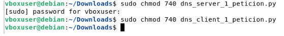
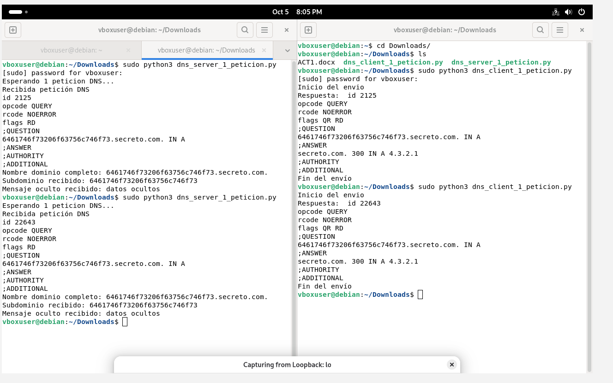
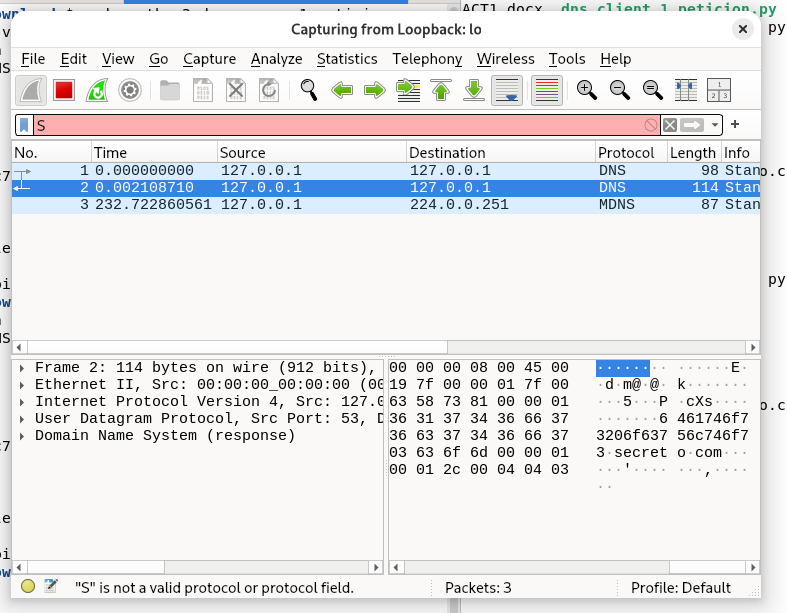
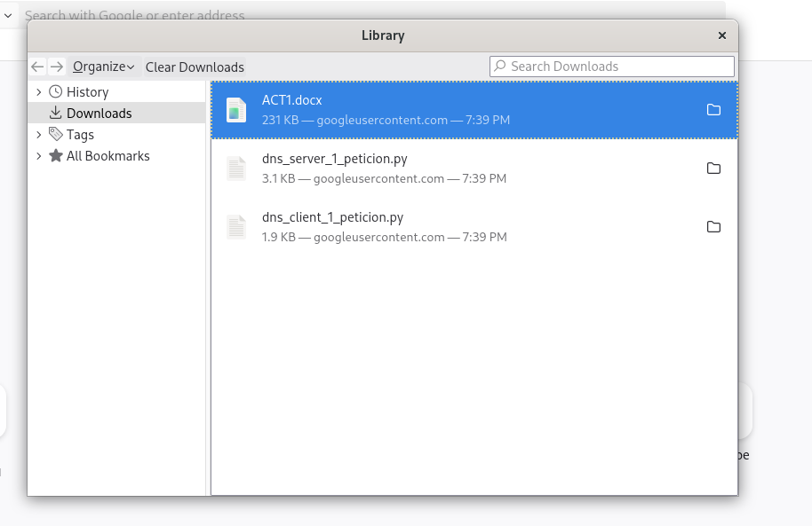

<details>
<summary><h2><b> 🌀DNS-WIRESHARK </b></h2></summary>

## Objetivo

El objetivo de esta práctica fue generar tráfico DNS desde Debian mediante un script en Python y analizar ese tráfico con Wireshark. La actividad permite relacionar una consulta realizada por una aplicación con los paquetes que circulan por la red para resolver un nombre de dominio.

Durante la práctica se ejecutó el script `dns_query.py` para realizar consultas DNS y se capturaron los paquetes generados. Posteriormente, se filtraron y analizaron las consultas y respuestas DNS para identificar el nombre solicitado, el tipo de registro, las direcciones obtenidas y el tiempo de respuesta.

## Estructura del repositorio

```text
.
├── README.md
├── dns_query.py
├── docs/
│   ├── ejecucion.md
│   ├── analisis-wireshark.md
│   └── seguridad-dns.md
└── capturas/
    ├── permisos.png
    ├── practica.png
    ├── practica_db.png
    └── practica_debian.png
```

- `dns_query.py`: script utilizado para generar consultas DNS.
- `docs/ejecucion.md`: guía de requisitos, instalación y uso en Debian.
- `docs/analisis-wireshark.md`: filtros y campos relevantes para interpretar paquetes DNS.
- `docs/seguridad-dns.md`: riesgos y buenas prácticas relacionados con DNS.
- `capturas/`: imágenes tomadas durante la realización de la actividad.

## Preparación en Debian

Para realizar la práctica se utilizó una máquina Debian con Python 3. El script usa la biblioteca `dnspython` para construir y enviar consultas DNS.

La dependencia se puede instalar desde los repositorios de Debian:

```bash
sudo apt update
sudo apt install python3-dnspython
```

Antes de iniciar la captura, se comprobó que el usuario tuviera los permisos necesarios para utilizar Wireshark y acceder a la interfaz de red. Esto permite observar los paquetes generados por el script sin necesidad de modificar el tráfico ni la configuración de red.



La captura muestra la preparación del entorno antes de iniciar el análisis. Contar con los permisos apropiados es necesario para que Wireshark pueda mostrar el tráfico DNS de la interfaz seleccionada.

## Generación de consultas DNS con Python

El script recibe como primer argumento el dominio que se desea consultar. De forma opcional, se puede indicar el tipo de registro DNS.

```bash
python3 dns_query.py example.com
```

Por defecto, se puede consultar un registro A, que normalmente devuelve una dirección IPv4. También se pueden realizar consultas de otros tipos, por ejemplo:

```bash
python3 dns_query.py example.com MX
python3 dns_query.py example.com AAAA
```

Al ejecutar el script se genera tráfico DNS entre el equipo Debian y el resolvedor DNS configurado. Wireshark permite comprobar que la consulta realizada por Python aparece realmente en la red.



Esta captura documenta la ejecución de la práctica. El objetivo de este paso es generar consultas DNS controladas para que puedan ser identificadas posteriormente en Wireshark.

## Captura de tráfico en Wireshark

Antes de ejecutar el script, se inició una captura en Wireshark sobre la interfaz de red utilizada por Debian. Después se ejecutó la consulta DNS desde la terminal y se detuvo la captura cuando aparecieron los paquetes relacionados.

Para localizar el tráfico DNS se pueden utilizar los siguientes filtros de visualización:

```text
dns
dns.flags.response == 1
dns.qry.name contains "example"
```

- `dns` muestra todos los paquetes DNS observados.
- `dns.flags.response == 1` limita la vista a las respuestas DNS.
- `dns.qry.name contains "example"` ayuda a localizar las consultas de un dominio concreto.



La captura representa el uso de filtros y la localización de los paquetes DNS generados durante la práctica. Separar consultas y respuestas facilita seguir el flujo completo de una resolución de nombre.

## Análisis de consultas y respuestas

Una consulta DNS contiene el nombre de dominio que se quiere resolver y el tipo de registro solicitado. En Wireshark, algunos campos relevantes son:

| Campo | Significado |
|---|---|
| `dns.qry.name` | Nombre de dominio solicitado por el cliente |
| `dns.qry.type` | Tipo de registro consultado, por ejemplo A, AAAA o MX |
| `dns.flags.response` | Indica si el paquete es una respuesta DNS |
| `dns.a` | Dirección IPv4 incluida en una respuesta de tipo A |
| `dns.aaaa` | Dirección IPv6 incluida en una respuesta de tipo AAAA |
| `dns.time` | Tiempo de respuesta DNS mostrado por Wireshark |

El análisis se realizó comparando la consulta con su respuesta. En la consulta se observa el dominio solicitado y el tipo de registro; en la respuesta se pueden ver las direcciones devueltas, los registros adicionales y, cuando corresponda, el código de respuesta DNS.



Esta captura muestra el resultado obtenido durante la práctica desde Debian. Se puede relacionar la salida del script con los paquetes observados en Wireshark: ambos representan la misma operación de resolución DNS.

## Flujo observado

1. Se inició Wireshark en la interfaz de red de Debian.
2. Se ejecutó `dns_query.py` con un dominio de prueba.
3. Python generó una consulta DNS para solicitar un registro del dominio.
4. El resolvedor DNS procesó la consulta y devolvió una respuesta.
5. Wireshark mostró los paquetes de consulta y respuesta asociados.
6. Se aplicaron filtros para identificar el dominio, el tipo de registro y la información devuelta.

Este proceso permitió comprobar que una resolución DNS no es solo el resultado mostrado por el script: también implica un intercambio de mensajes DNS que puede analizarse a nivel de red.

## Seguridad DNS

Durante el análisis se tuvieron en cuenta algunas buenas prácticas:

- Evitar capturar o compartir tráfico que contenga información sensible.
- Revisar dominios desconocidos o con patrones anómalos.
- Usar filtros para limitar el análisis al tráfico necesario.
- Tener en cuenta que DNS tradicional puede circular sin cifrado.
- Consultar `docs/seguridad-dns.md` para ampliar los riesgos de *spoofing*, envenenamiento de caché y túneles DNS.

## Conclusión

La práctica permitió generar y observar tráfico DNS desde Debian de forma controlada. El script Python realizó consultas de dominios y Wireshark permitió identificar las consultas enviadas, las respuestas recibidas y los datos contenidos en los paquetes.

Con ello se comprendió la relación entre una aplicación que solicita una resolución DNS y el tráfico de red que hace posible esa resolución. Las capturas incluidas documentan la preparación del entorno, la ejecución de las consultas, el filtrado de paquetes y el resultado obtenido.
